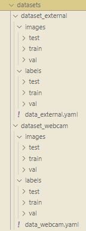

# people-counter
### **Goal**: Create a repository that can serve as a backbone for finetuning object detection models on individual web cams so that they can be used to count objects.

The Camden Snow Bowl hosts a [web cam](https://camdensnowbowl.com/web-cam/) that displays the conditions at the base of the mountain. I have fine tuned a YOLOv11 model on a publicly available ['person detection' dataset](https://universe.roboflow.com/titulacin/person-detection-9a6mk/dataset/16), followed by a second fine tuning step on a private dataset created through assisted labeling of frames captured from the Camden Snow Bowl.


A comparison of the two models can be seen in the below gif.


This repo currently only supports counting of one object, as the workflow for labelling your own dataset does not allow for multiple classes. However, if another tool is used for labelling your own data, like CVAT, then this repository could be used for fine tuning an object detection model to count multiple types objects from a web cam.


## Steps to Reproduce
If you already have Conda installed you can build and activate a suitable environment by executing the below command. If you do not have Conda installed I recommend [installing Miniconda](https://www.anaconda.com/docs/getting-started/miniconda/install). Conda helps grab non-Python related dependencies, which tools like Pip and Poetry fail to grab. FFMPEG is an example of a dependency that I've noticed missing when attempting to create a working environment using only Pip. 
```bash
bash create_env.sh 
```
You will be asked if you would like to download the CUDA enabled PyTorch libraries. Respond Y if you have a GPU that supports them.

Once you have the environment activated, you can utilize this repo to finetune a model on your webcam by following these steps:

1) Update the `src/config/.env`, specifically:
    * The `webcam_url` parameter should point to your url. The url should open up a video stream that does not require any user interaction (like pressing play). Also, change the `webcam_name` parameter to something fitting.
    * The `target_label` parameter should be updated if you want to detect something other than people. Look through the classes listed in `default_classes.txt`. If one of the default labels matches what you are trying to detect then update `target_label` to that label. If nothing matches, then set this parameter to the new label of your choice.
    * The `frame_interval` parameter determines the frequency at which frames from your webcam are saved to your device.
    * The `duration_hours` parameter sets the number of hours frames are captured when executing `src/capture_finetuning_images.py`. 
    * The `model_path` parameter sets the pretrained model to be used as a starting point. I suggest using a smaller model, like YOLOv11n, if your compute is limited or you need to run inference very quickly. If accuracy is of the utmost importance and you have the compute then I suggest starting with something like YOLOv11l. Pretrained base models can be found in `src/models`. If you have already fine tuned a model and wish to continue training it then you should change your model path to point to your fine tuned model. Finetuned models will be saved with the name `best.pt` and located in a subfolder of a folder with the same title as the `project_name` parameter.  

    These settings are used to determine how you collect frames to finetune on. Ideally, you will have a dataset with at least a few hundred frames that contains a wide array of conditions (like night time / daytime photos if you want your model to work in both conditions, crowded and sparse conditions, stormy and nice weather, etc.) When collecting frames for the Camden Snowbowl webcam model, I made sure to execute `src/capture_finetuning_images.py` during the morning, afternoon, and evening, as well as during snowstorms and sunny days.
2) Execute `src/capture_finetuning_images.py` over a timespan long enough to collect a good training dataset. This will likely require you to manually execute this script multiple times, during different weather conditions and times of the day. The number of frames saved from each execution will depend on your `frame_interval` and `duration_hours` values. Bear in mind that you must manually label these frames, so only capture as many images as you are comfortable annotating. Frames captured by this script will be saved to `images_for_manual_labeling/images` and annotation files will be saved to `images_for_manual_labeling/labels/model_default`. Annotation files will be generated using the model set by your `model_path` parameter in the `src/config/.env` file. 

<p align='center'>
    <p align="right">
        
        <br>
        <i>Example of the capture_finetuning_images.py output and the basic YOLO format. The image (.jpg) and annotation (.txt) file have the same name but different extensions and filepaths. The lines of text in the .txt file displayed indicate that three objects with id=0 were identified. Each row in the .txt file displays the following: class_id x_center_norm y_center_norm width_norm height_norm</i>
    </p>
</p>

3) Once you have saved frames you can begin manually labeling them. You can perform this step in parallel with step 2. To begin, execute `src/manual_train_annotation.py`. This should display an image from the `images_for_manual_labeling` directory (specifically, images that don't have an associated annotation file in the `images_for_manual_labeling/labels/manually_labeled` folder) with bounding boxes for objects detected by the model used when you ran `src/capture_finetuning_images.py`. If the bounding box positioned poorly or it detects an object not of interest to you then you should remove it by right clicking inside of it. To create new bounding boxes, simply left click twice to define the corners of your box. Press enter when you are done labelling all of the objects of interest in your frame to saved your annotation file and move on to the next frame. Pressing enter will move the annotation file from the `images_for_manual_labeling/labels/model_defaults` to the `images_for_manual_labeling/labels/manually_labelled` folder. If you inadvertently press enter and want to re-edit a file using this tool then you will have to move that file back into the `images_for_manual_labeling/labels/model_defaults` folder. 

<p align="center">
    <video width="600" controls>
        <source src="manual_train_annotation_demo.mp4" type="video/mp4">
        Your browser does not support the video tag.
    </video>
</p>


4) When you have labeled enough frames (~hundreds ideally) you can begin finetuning the default YOLO model. You can choose to do this locally, or on the cloud. I wanted to gain experience with AWS, so I trained a YOLOv11l (l for large) model on an EC2 instance with CUDA. With a training set of around 400 images it took me about 3 hours and cost about $2.50 to finetune the model. However, I also finetuned the YOLO model on a [publicly available dataset for people detection (~5000 images)](https://universe.roboflow.com/titulacin/person-detection-9a6mk/dataset/16) before finetuning it on my dataset. Performing two stages of finetuning allowed for me to easily make use of public data to improve my models ability to detect people. I was then able to further finetune it for the Snow Bowl`s webcam, which primarily shows people on skis and snowboards with helmets on.
    
    **Note:** If you have a public (or external, as it is referred to in the code) dataset that you would like to make use of then you must move it into the `datasets/dataset_external` repository. You must make sure the dataset is in the YOLO format (image files and annotation files have the same name and annotations are saved as text files in the format of "class_id x_center_norm y_center_norm width_norm height_norm", where norm means normalized by the images original shape). The images should be in the images subfolder and the labels/annotations in the labels subfolder:

    <p align="center">
        
    </p>

test dominicdill/people-counter/blob/main/manual_train_annotation_demo.mp4
    
[](https://raw.githubusercontent.com/dominicdill/people-counter/main/manual_train_annotation_demo.mp4)


    
    Additionally, you must make sure that the class id used to identify your objects matches. If the external dataset has people, but they have an id of 1, while yours have an id of 0, then you must change the class id of the external dataset to match yours. 


